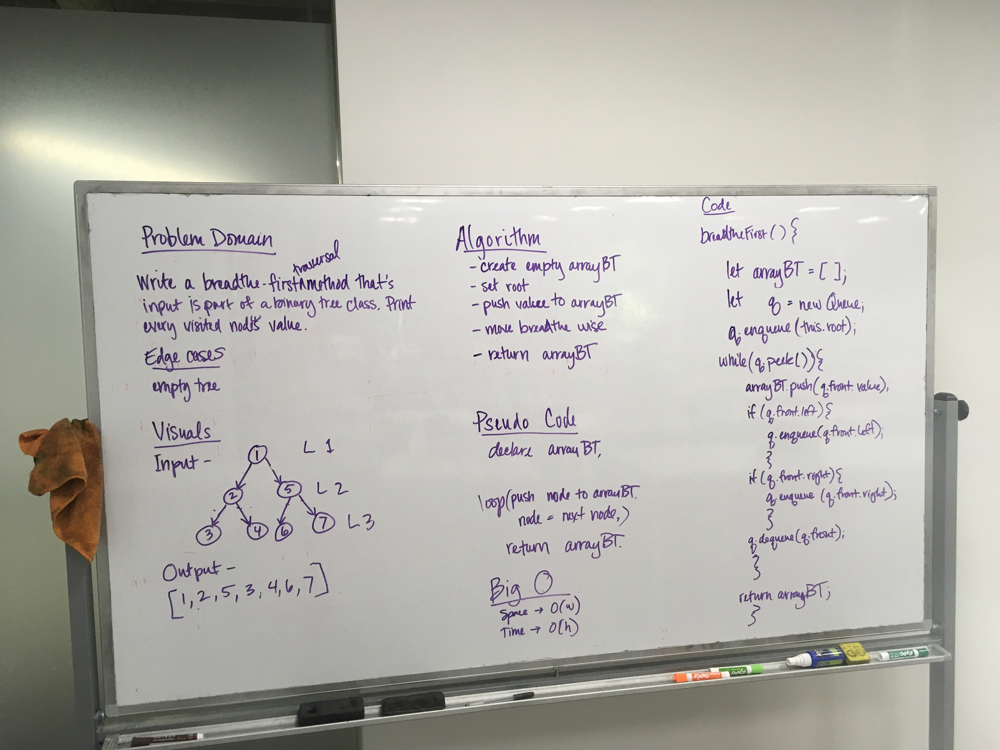

## Breadth First

# Challenge Summary
Learning to traverse a Binary Tree breadth first. 

## Challenge Description
* Write a breadth first traversal method which takes a Binary Tree as its unique input. Without utilizing any of the built-in methods available to your language, traverse the input tree using a Breadth-first approach; print every visited node’s value.

## Solution
* I worked with Xochil, Alistair, and Karl. 
