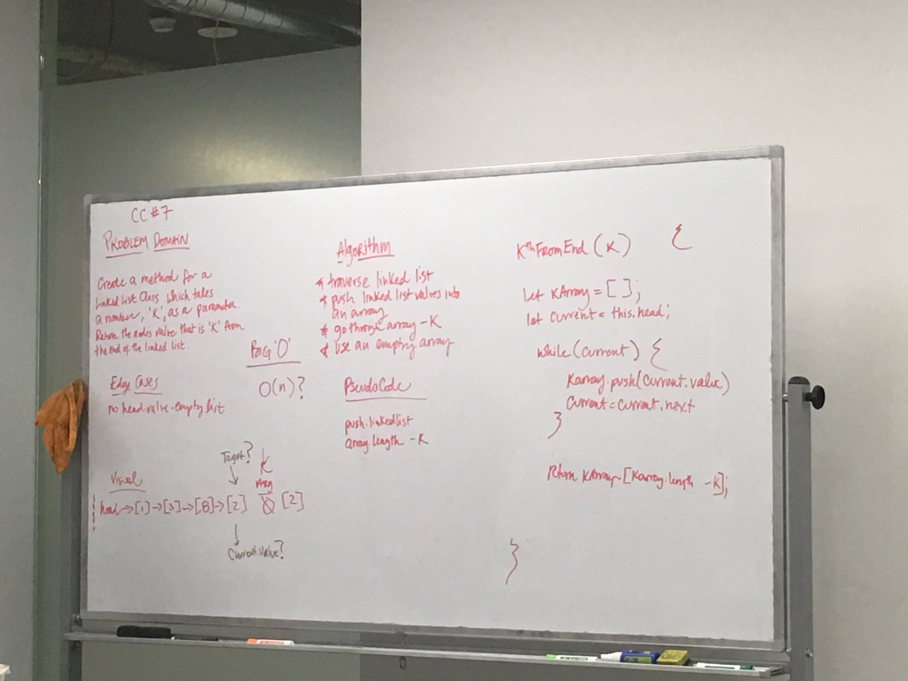

## Kth from the End

# Challenge Summary
Finding a node a specific number of nodes from the end of the LL. 

## Challenge Description
* Write a method for the Linked List class which takes a number, `k`, as a parameter. Return the node’s value that is k from the end of the linked list. You have access to the Node class and all the properties on the Linked List class as well as the methods created in previous challenges.

## Solution
* I worked with Xochil, Alistair, and Karl. 
