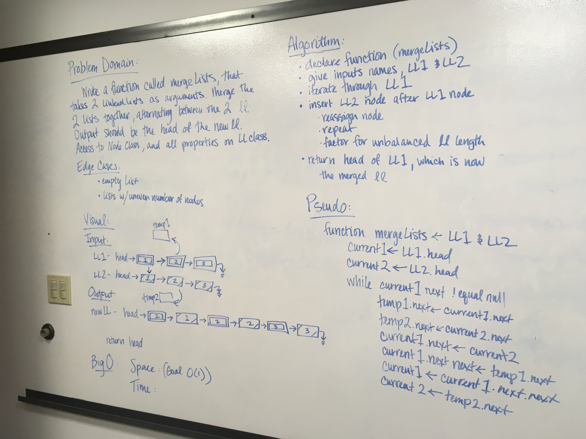

# LL-Merge

# Challenge Summary
Take 2 LL and merge them in an alternating order. 

## Challenge Description
* Write a function called `mergeLists` which takes two linked lists as arguments. Zip the two linked lists together into one so that the nodes alternate between the two lists and return a reference to the head of the zipped list. Try and keep additional space down to O(1). You have access to the Node class and all the properties on the Linked List class as well as the methods created in previous challenges.

## Approach & Efficiency
I first attempt to just use previous methods, but got a little turned around, so then attempted the current code. 

## Solution

